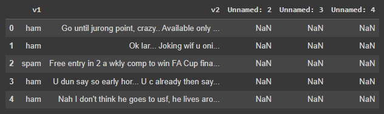
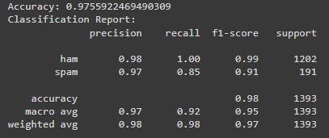

# Implementation-of-SVM-For-Spam-Mail-Detection

## AIM:
To write a program to implement the SVM For Spam Mail Detection.

## Equipments Required:
1. Hardware – PCs
2. Anaconda – Python 3.7 Installation / Jupyter notebook

## Algorithm
1. Import the required packages.
2. Import the dataset to operate on.
3. Split the dataset.
4. Predict the required output.
5. End the program.

## Program:
```
Program to implement the SVM For Spam Mail Detection..
Developed by: SUDHIR KUMAR .R
RegisterNumber: 212223230221
```
```PYTHON
import numpy as np
import pandas as pd
from sklearn.model_selection import train_test_split
from sklearn.feature_extraction.text import CountVectorizer
from sklearn import svm
from sklearn.metrics import classification_report, accuracy_score

df=pd.read_csv("/content/spam.csv",encoding='ISO-8859-1')
df.head()

vectorizer = CountVectorizer()
X = vectorizer.fit_transform(df['v2'])
y = df['v1']

X_train, X_test, y_train, y_test = train_test_split(X, y, test_size=0.25, random_state=42)

model = svm.SVC(kernel='linear')
model.fit(X_train, y_train)

predictions = model.predict(X_test)
print("Accuracy:", accuracy_score(y_test, predictions))
print("Classification Report:")
print(classification_report(y_test, predictions))
```
## Output:






## Result:
Thus the program to implement the SVM For Spam Mail Detection is written and verified using python programming.
